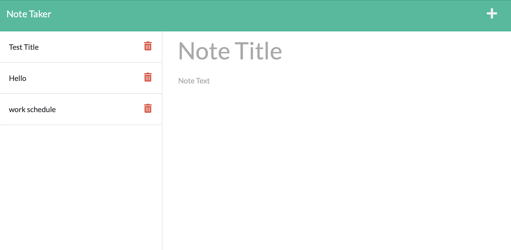

# Note_Taker

## About this challenge

As a small business owner, the user should to be able to write and save notes, so that they can organize their thoughts and keep track of tasks they need to complete.
 

## User Story

AS A small business owner, the user should to be able to write and save notes, so that they can organize their thoughts and keep track of tasks they need to complete.

## Criteria

- A note-taking application is given.

- When the user opens the Note Taker, then presented with a landing page with a link to a notes page.

- When clicking on the link to the notes page, then they are presented with a page with existing notes listed in the left-hand column, plus empty fields to enter a new note title and the note’s text in the right-hand column.

- When they enter a new note title and the note’s text, then a Save icon appears in the navigation at the top of the page.

- When clicking on the Save icon, then the new note that is entered is saved and appears in the left-hand column with the other existing notes.

- When clicking on an existing note in the list in the left-hand column, then that note appears in the right-hand column.

- When clicking on the Write icon in the navigation at the top of the page, then presented with empty fields to enter a new note title and the note’s text in the right-hand column.

## The Program Guidelines

- The application should have a db.json file on the back end that will be used to store and retrieve notes using the fs module.

- The following HTML routes should be created:
  - GET /notes should return the notes.html file.
  - GET * should return the index.html file.

- The following API routes should be created:
  - GET /api/notes should read the db.json file and return all saved notes as JSON.
  - POST /api/notes should receive a new note to save on the request body, add it to the db.json file, and then return the new note to the client. You'll need to find a way to give each note a unique id when it's saved.

## Extras

- This application has that functionality in the front end to handle Delete. As a bonus, see if you can add the DELETE route to the application using the following guideline:
  - DELETE /api/notes/:id should receive a query parameter containing the id of a note to delete. 
  In order to delete a note, you'll need to read all notes from the db.json file, remove the note with the given id property, and then rewrite the notes to the db.json file.

- The following image demonstrates the application functionality:

## Deployed site on heroku
https://notetaker-sindhu.herokuapp.com

## Github Repository URL
https://github.com/sindhu-sp/Note_Taker

## Technologies Used:
- HTML
- CSS
- Javascript

#### Sindhu Pillai

